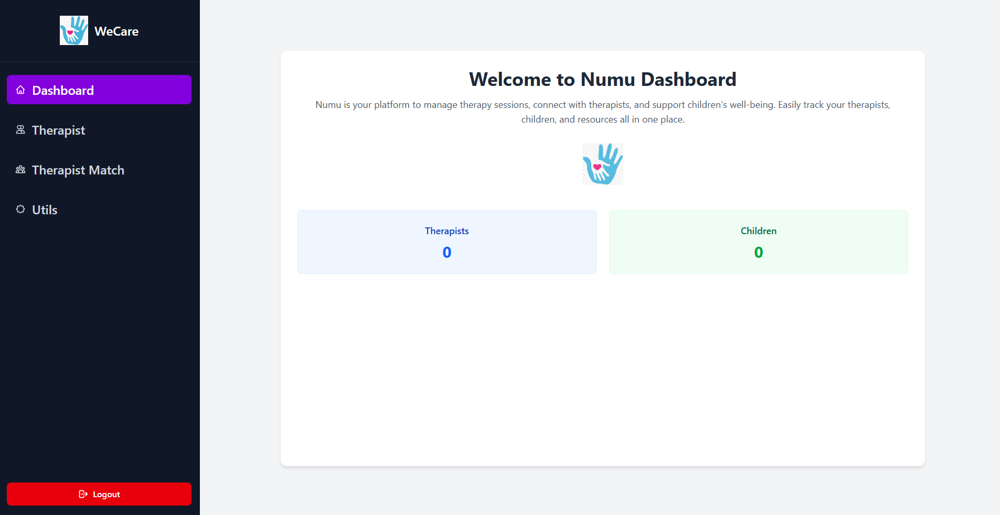

# Numu Admin



Numu Admin is a modern admin dashboard for managing parents, therapists, and suggest therapists to parents. Built with [Vite](https://vitejs.dev/) for lightning-fast development, it leverages [Firebase](https://firebase.google.com/) for authentication and secure user management.

## Features

- 🔒 Secure authentication with Firebase
- 👩‍⚕️ Manage therapists and their expertise
- 👶 Manage children and their concerns
- 🤝 Match children with therapists
- ⚡️ Built with Vite for fast development and hot reloads

## Getting Started

### 1. Clone the repository

```bash
git clone git@github.com:Ibranista/numu-admin.git
```

### 2. Install dependencies

```bash
npm install || pnpm install || yarn
```

### 3. Configure environment variables

Copy the example environment file and fill in your Firebase and API credentials:

```bash
cp example.env .env
```

Edit `.env` and set the required values (see `example.env` for guidance).

### 4. Run the development server

```bash
npm run dev
```

The app will be available at [http://localhost:5173](http://localhost:5173) (or your configured port).

## Project Structure

- `src/` - Main source code
- `src/features/` - Redux slices and thunks for app features
- `src/components/` - Reusable UI components
- `src/ui/` - Page-level components
- `src/firebase.ts` - Firebase configuration and helpers

## Notes

- Make sure you have a Firebase project set up and the correct credentials in your `.env` file.
- For API integration, ensure your backend is running and accessible at the URL specified in your environment variables.

## License

MIT

---

**Happy managing with Numu Admin!**
